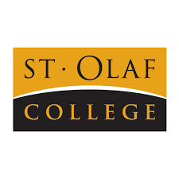

# Hi, I'm Adrienn Nagy

{width=250px fig-align="center"}

Welcome to my personal data science portfolio!

---

## About Me

I am a current sophomore at St. Olaf College interested in data science and statistics. I enjoy working with data to understand the world around me better and uncover patterns I might not have noticed otherwise. 

This website showcases some of the work I have completed this semester, including a text analysis project and a data visualization project.

---

## What You'll Find Here

- **Text Analysis Project** – exploring patterns in text data  
- **Maps Project** – interactive U.S. state-level visualizations  

